# Predicting Purchase Intent in Online Retail: A Binary Classification Study

**Dataset:** Online Shoppers Purchasing Intention — UCI Machine Learning Repository  
**Reference:** Sakar & Kastro (2018). https://doi.org/10.24432/C5F88Q

---

## Executive Summary

This study applies supervised machine learning to predict whether an e-commerce session will generate revenue, using the UCI Online Shoppers Purchasing Intention dataset (12,330 sessions, 17 features, 15.47% positive rate). Five classifiers were trained and evaluated under two feature scenarios — with and without `PageValues` — to assess both peak performance and real-world deployability.

The champion Random Forest achieves **F1 = 0.6516, ROC-AUC = 0.9202, PR-AUC = 0.7109** with `PageValues` included. Gradient Boosting is the strongest competitor on ranking metrics (ROC-AUC = 0.9264, PR-AUC = 0.7363), but its lower recall (0.5864 vs. 0.7539) and inability to handle class imbalance natively make Random Forest the more robust production choice. Removing `PageValues` causes F1 to fall from 0.6516 to 0.3991, highlighting that deployment context — whether the feature is observable at prediction time — fundamentally determines which model should be used. Business-value analysis shows the model at a threshold of 0.29 generates **74% more value** than untargeted campaigns.

---

## 1. Problem Definition

### 1.1 Business Context

E-commerce platforms face a fundamental targeting problem: every visitor has a different probability of completing a purchase, yet most sites either treat all visitors identically or rely on crude heuristics (e.g., cart abandonment triggers). A session-level purchase-intent classifier enables a more precise intervention strategy — personalized offers, live chat prioritization, dynamic pricing, or recommendation block changes — delivered only to visitors with a sufficiently high predicted purchase probability.

The business value of such a model is asymmetric. Correctly targeting a genuine buyer (true positive) generates revenue lift far exceeding the marginal cost of a marketing action (false positive). Conversely, missing a genuine buyer (false negative) has an opportunity cost but no direct action cost. This asymmetry directly shapes model selection, threshold tuning, and the cost matrix used in evaluation.

### 1.2 Formal Problem Statement

Given a feature vector **x** describing an anonymized browsing session, predict the binary label *y* ∈ {0, 1}, where *y* = 1 indicates the session resulted in a completed transaction (`Revenue = True`).

This is a **supervised binary classification** problem with the following structural characteristics:

- **Class imbalance**: approximately 15.5% positive sessions, requiring metrics beyond accuracy.
- **Mixed feature types**: numerical behavioral metrics, ordinal codes, and binary indicators, requiring a multi-branch preprocessing pipeline.
- **Asymmetric misclassification costs**: false negatives and false positives carry different business consequences, motivating threshold optimization beyond the default 0.50 cutoff.
- **Feature availability uncertainty**: the most predictive feature (`PageValues`) is a session-level aggregate potentially computed only after the session ends, creating a deployment-time trade-off between model accuracy and real-time usability.

---

## 2. Data Description and Exploratory Analysis

### 2.1 Dataset Overview

The dataset was collected from an unnamed e-commerce website over a 12-month period. Each row represents one unique user session, and the target variable `Revenue` records whether the session concluded with a transaction. The dataset contains no personally identifiable information.

**Dataset audit:**

| Check | Result | Comment |
| --- | ---: | --- |
| Rows | 12,330 | Sufficient for stratified modelling |
| Columns | 18 | 17 features + 1 target |
| Missing values | 0 | No imputation required |
| Fully duplicated rows | 125 | ~1% of dataset; retained (see §2.3) |
| Revenue = True | 1,908 | 15.47% positive rate |
| Revenue = False | 10,422 | 84.53% majority class |

**Target class distribution:**

| Revenue | Count | Share |
| --- | ---: | ---: |
| False | 10,422 | 84.53% |
| True | 1,908 | 15.47% |

The 15.47% positive rate constitutes a moderate class imbalance. A naive classifier predicting the majority class at all times would achieve 84.53% accuracy while identifying zero buyers — a result that is statistically impressive but operationally worthless. All subsequent evaluation therefore focuses on **F1-score, Recall, Precision, ROC-AUC, and PR-AUC**, which jointly characterize performance on the minority class.

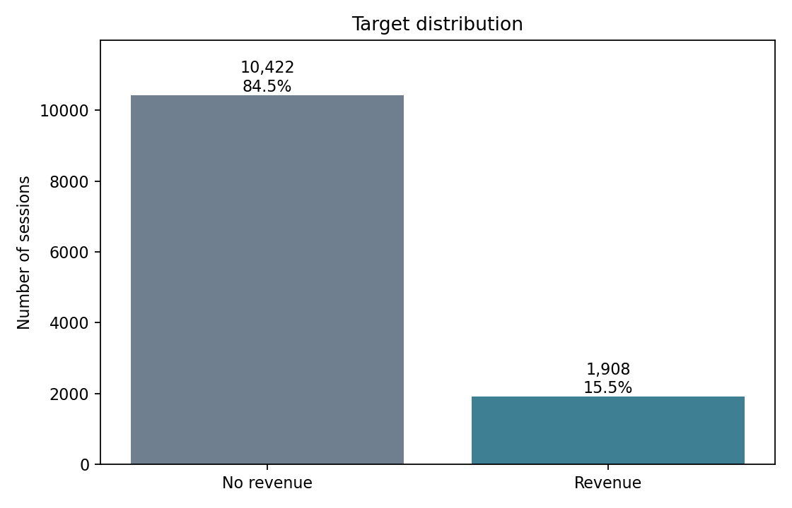

### 2.2 Feature Description

Features fall into four conceptually distinct groups:

**Page interaction counts and durations** (`Administrative`, `Administrative_Duration`, `Informational`, `Informational_Duration`, `ProductRelated`, `ProductRelated_Duration`): these capture the depth of browsing engagement across three page categories. Duration variables measure cumulative time in seconds. Right-skewed distributions are expected — most visitors browse few pages for short durations, while a small segment exhibits prolonged, deep engagement.

**Web analytics behavioral signals** (`BounceRates`, `ExitRates`, `PageValues`): these are Google Analytics-style metrics. `BounceRates` is the fraction of entrances to a page that immediately leave the site. `ExitRates` is the fraction of page views that are the last in the session. `PageValues` is the estimated monetary value of a page, derived from e-commerce conversion tracking — specifically, the average value of pages visited before a transaction occurs. This feature has a direct causal interpretation: sessions where the visitor navigated through high-value pages are more likely to convert.

**Calendar and campaign context** (`Month`, `SpecialDay`, `Weekend`): `Month` captures seasonality effects. `SpecialDay` measures proximity to notable dates (e.g., Valentine's Day, Mother's Day) on a 0–1 scale, where values closer to 1 indicate proximity. `Weekend` is a binary indicator.

**Technical and traffic metadata** (`OperatingSystems`, `Browser`, `Region`, `TrafficType`, `VisitorType`): these characterize the technical and acquisition context of the visit. `VisitorType` distinguishes Returning Visitors, New Visitors, and a small Other category.

### 2.3 Data Quality Assessment

**Duplicated rows:** 125 rows (1.01%) are fully duplicated across all 17 features. These were retained rather than removed. In a session-level dataset, two distinct visitors may legitimately produce identical feature vectors — same browser, same OS, same page sequence, same durations rounded to the same integer. Removing duplicates on the basis of feature identity alone, without a session identifier, risks discarding genuine observations. The downstream impact on model performance is negligible at 1%.

**Outliers:** IQR-based outlier detection reveals substantial right-skew in several numerical features:

| Feature | Outlier Count | Outlier Rate | Note |
| --- | ---: | ---: | --- |
| Browser | 4,369 | 35.4% | Ordinal code — not a true outlier |
| PageValues | 2,730 | 22.1% | Genuine high-value sessions |
| Informational | 2,631 | 21.3% | Heavy information-seekers |
| Informational_Duration | 2,405 | 19.5% | Long-duration variant |
| BounceRates | 1,551 | 12.6% | Sessions with high bounce signal |
| ExitRates | 1,099 | 8.9% | Sessions exiting on product pages |

No outlier removal was performed. These extreme values represent real user behaviors — a visitor who reads 20 informational pages has a genuinely unusual session, and discarding that record would corrupt both the training signal and the test-set distribution. Tree-based models (Random Forest, Gradient Boosting, Decision Tree) are inherently robust to feature scale and outliers because splits are determined by rank order, not by absolute magnitude.

**Missing values:** None. All 17 features are fully observed across all 12,330 sessions.

### 2.4 Exploratory Data Analysis

#### Correlation with the Target

Pearson correlations between numerical features and the binary target `Revenue` (encoded as 0/1) provide a first-pass signal ranking:

| Feature | Correlation with Revenue | Direction |
| --- | ---: | --- |
| PageValues | +0.493 | Strong positive — high page value → more likely to buy |
| ExitRates | −0.207 | Negative — high exit intent → less likely to buy |
| ProductRelated | +0.159 | Positive — more product pages → more likely to buy |
| ProductRelated_Duration | +0.152 | Positive — longer product browsing → more likely to buy |
| BounceRates | −0.151 | Negative — bouncing visitors → less likely to buy |
| Administrative | +0.139 | Positive — account/checkout activity → more likely to buy |
| Informational | +0.095 | Weak positive |
| Administrative_Duration | +0.094 | Weak positive |
| SpecialDay | −0.082 | Negative — special-day proximity lowers conversion rate |

The dominant signal is `PageValues` (r = 0.493), which is roughly 2.4× the magnitude of the next-strongest predictor. This outsized influence has important implications for model deployment (see §3.3 and §5.2).

`BounceRates` and `ExitRates` are negatively correlated with conversion, as expected: sessions where the visitor immediately leaves or frequently navigates away from pages exhibit lower purchase intent. Interestingly, `SpecialDay` shows a modest negative correlation — proximity to commercial holidays may increase browsing but not necessarily purchasing, possibly because visitors are browsing for gift ideas rather than buying immediately.

#### Seasonality and Temporal Patterns

Conversion rates vary substantially by month, indicating strong seasonality:

| Month | Conversion Rate | Session Volume |
| --- | ---: | ---: |
| February | 1.6% | 184 |
| March | 10.1% | 1,907 |
| May | 10.9% | 3,364 |
| June | 10.1% | 288 |
| July | 15.3% | 432 |
| August | 17.6% | 433 |
| September | 19.2% | 448 |
| October | 20.9% | 549 |
| November | **25.4%** | 2,998 |
| December | 12.5% | 1,727 |

November stands out with the highest conversion rate (25.4%) across 2,998 sessions — consistent with Black Friday and pre-holiday shopping. February shows the lowest rate (1.6%), likely reflecting post-holiday fatigue with minimal promotional activity. This seasonal pattern means that a model trained on the full-year dataset implicitly learns month as a proxy for purchase intent; temporal generalization to future periods should be validated separately.

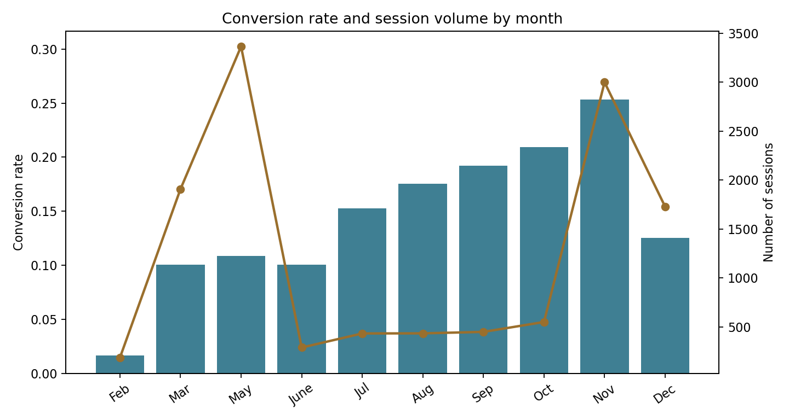

#### Visitor Type Segmentation

| Visitor Type | Conversion Rate | Session Count |
| --- | ---: | ---: |
| New Visitor | 24.9% | 1,694 |
| Other | 18.8% | 85 |
| Returning Visitor | 13.9% | 10,551 |

New visitors convert at a materially higher rate (24.9% vs. 13.9%) despite comprising only 13.7% of sessions. This counter-intuitive finding may reflect selection bias: new visitors who arrive via paid search or targeted campaigns often have higher purchase intent than casual returning browsers. Returning visitors represent the bulk of traffic and set the baseline for the imbalanced target rate.

#### PageValues as the Dominant Behavioral Signal

The most striking EDA finding is the stark difference in `PageValues` between revenue and non-revenue sessions:

| Revenue | Median PageValues | Median ProductRelated | Median BounceRates | Median ExitRates |
| --- | ---: | ---: | ---: | ---: |
| False | 0.00 | 16.0 | 0.00426 | 0.02857 |
| True | 16.76 | 29.0 | 0.00000 | 0.01600 |

The median `PageValues` for non-revenue sessions is exactly zero, meaning more than half of non-converting visitors never view a page with assigned monetary value. Revenue sessions have a median of 16.76 and frequently reach much higher values in the right tail. This bimodal distribution — a mass of zeros followed by a long right tail — explains both the feature's dominant predictive power and why it must be handled carefully in preprocessing (StandardScaler is applied inside the pipeline; however, a log(1+x) transformation could further improve its linearity in downstream linear models).

Revenue sessions also show deeper product browsing (median 29 vs. 16 product-related pages) and lower bounce and exit rates — behavioral patterns consistent with high-intent visitors who are actively researching specific products.

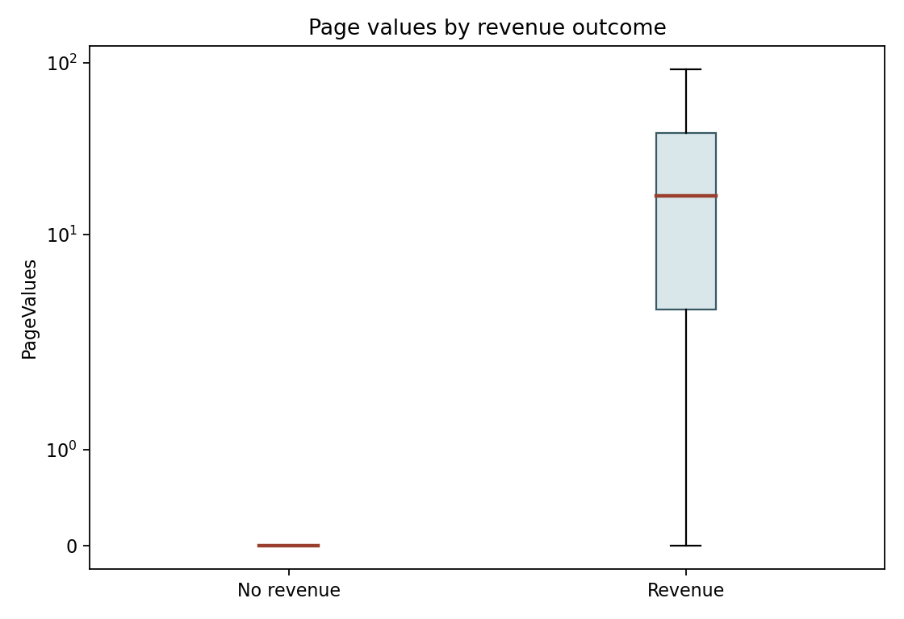

Additional EDA figures are provided in the appendix: conversion by visitor type (A1), product browsing duration by revenue (A2), correlation heatmap (A3), bounce/exit rate scatter (A4), and full numerical distributions (A5).

---

## 3. Champion Model

### 3.1 Model Selection Rationale

The champion model is a **Random Forest classifier** configured with `class_weight='balanced_subsample'`. The selection is motivated by the following properties:

- **Non-linearity**: The EDA reveals that `PageValues`, `ExitRates`, and browsing depth interact in ways that a linear decision boundary cannot capture. Random Forest automatically learns arbitrary non-linear splits and feature interactions without explicit feature engineering.
- **Robustness to feature scale and outliers**: Because splits are determined by rank-based thresholds, not by the absolute magnitude of features, Random Forest is unaffected by the heavy right-skew observed in page duration and page count variables.
- **Native class imbalance handling**: The `balanced_subsample` option re-weights the bootstrap sample of each tree to reflect the inverse class frequency. This directly addresses the 15.47%/84.53% split without generating synthetic data, which could introduce artificial feature combinations in a mixed-type dataset.
- **Ensemble variance reduction**: By averaging predictions across 120 independently randomized trees, Random Forest substantially reduces the overfitting tendency of single decision trees, improving generalization particularly on the precision dimension.
- **Interpretability through feature importance**: Permutation importance and SHAP values provide post-hoc explanation of predictions, which is valuable for both model debugging and business stakeholder communication.

### 3.2 Experimental Methodology

**Train/test split:** An 80/20 stratified split yields 9,864 training sessions and 2,466 test sessions. Stratification preserves the 15.47% positive rate in both partitions, ensuring that the test evaluation reflects the true class prior. The test set was held out entirely and never used during training or hyperparameter search.

**Cross-validation:** 3-fold stratified cross-validation was applied to the training set during GridSearchCV. Each validation fold contains approximately 3,288 sessions (≈509 revenue sessions), sufficient for a stable F1 estimate. The same fold structure was applied consistently across all models to ensure fair comparison.

**Preprocessing pipeline:** A `ColumnTransformer` applies:
- `StandardScaler` to all numerical features (zero mean, unit variance).
- `OneHotEncoder(handle_unknown='ignore')` to all categorical features.

The transformer is fitted exclusively on training data within each CV fold, preventing any information from validation or test folds from influencing the feature scaling — a critical practice for avoiding leakage.

**Hyperparameter search (Random Forest):**

| Parameter | Values searched | Selected |
| --- | --- | ---: |
| `max_depth` | `[8, None]` | `None` (unpruned) |
| `min_samples_leaf` | `[5, 20]` | `5` |
| `max_features` | `['sqrt']` | `'sqrt'` |
| `n_estimators` | Fixed at 120 | 120 |

The selected configuration uses unpruned trees (`max_depth=None`) with a small leaf constraint (`min_samples_leaf=5`), allowing each tree to capture fine-grained patterns while preventing leaves from containing trivially small samples. `max_features='sqrt'` is the standard randomization parameter for classification forests, decorrelating individual trees to maximize ensemble diversity.

**Optimization metric:** GridSearchCV optimizes F1-score on the minority class. Accuracy is deliberately excluded as the primary criterion because it rewards the majority-class prediction; F1 captures the balance between precision and recall for the positive class, which is directly tied to business value.

**Class imbalance strategy:** SMOTE-based oversampling was considered but rejected. SMOTE generates synthetic minority-class samples by interpolating between existing observations in the numerical feature space. For a dataset with mixed numerical and categorical variables, SMOTE can produce implausible samples — for example, a non-integer `OperatingSystems` value, or a `Month` that falls between two valid calendar months. Class weighting (`balanced_subsample`) adjusts the contribution of each real sample to the loss function without manufacturing artificial data points, making it the safer and more principled choice here.

### 3.3 Champion Performance

**Test-set metrics (with PageValues):**

| Metric | Value | Interpretation |
| --- | ---: | --- |
| Accuracy | 0.8751 | Misleading alone — driven by majority class |
| Balanced Accuracy | 0.8256 | Average recall across both classes — strong |
| Precision | 0.5737 | 57.4% of flagged sessions are genuine buyers |
| Recall | 0.7539 | 75.4% of genuine buyers are identified |
| F1-score | 0.6516 | Harmonic mean of precision and recall |
| ROC-AUC | 0.9202 | Excellent ranking ability across all thresholds |
| PR-AUC | 0.7109 | 4.6× above random baseline (0.155) |

The PR-AUC of 0.7109 deserves emphasis. For an imbalanced classification problem, PR-AUC is a more demanding metric than ROC-AUC: a random classifier achieves PR-AUC equal to the positive rate (0.155 in this dataset), while ROC-AUC always equals 0.5 for a random classifier regardless of imbalance. The champion's PR-AUC of 0.7109 therefore represents a 4.6× improvement over random ranking — meaning the model is substantially better at concentrating true buyers in its top-scored sessions.

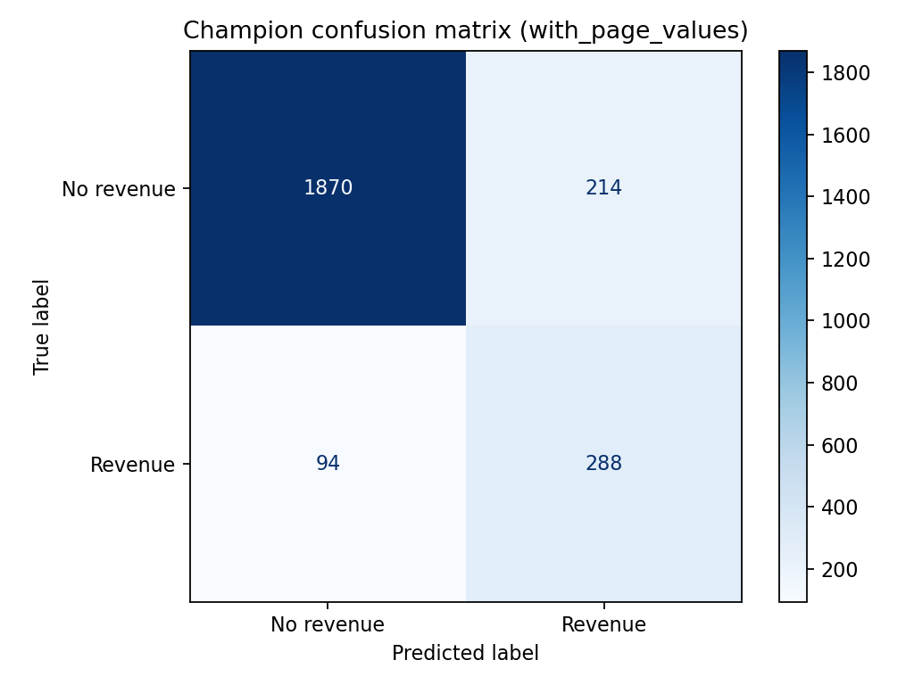

At the default threshold of 0.50, the champion correctly identifies 288 of 382 genuine buyers in the test set (75.4% recall), while incorrectly flagging 214 non-buyers (false positives). The 94 missed buyers (false negatives) are the costliest errors from a business perspective, since they represent revenue opportunities not captured by the model's intervention.

### 3.4 Feature Scenarios: With and Without PageValues

`PageValues` has the highest correlation with the target (r = 0.493) and dominates permutation importance (see §5). However, whether it is observable at prediction time depends on the deployment architecture. If the model scores visitors as they browse (early-session scoring), `PageValues` may not yet have been computed. If scoring is done at the end of session or on a lookback basis, it is available.

To quantify the deployment-time risk, the champion was re-trained after removing `PageValues`:

| Scenario | Accuracy | Bal. Accuracy | Precision | Recall | F1 | ROC-AUC | PR-AUC |
| --- | ---: | ---: | ---: | ---: | ---: | ---: | ---: |
| With PageValues | 0.8751 | 0.8256 | 0.5737 | 0.7539 | 0.6516 | 0.9202 | 0.7109 |
| Without PageValues | 0.6861 | 0.6807 | 0.2837 | 0.6728 | 0.3991 | 0.7572 | 0.3529 |
| Δ (with − without) | +0.0890 | +0.1449 | +0.2900 | +0.0811 | +0.2525 | +0.1630 | +0.3580 |

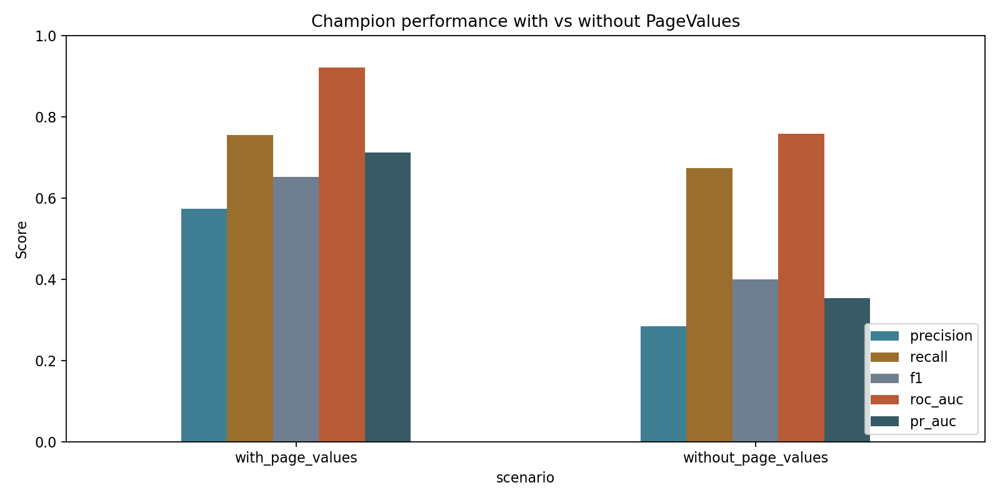

Removing `PageValues` reduces F1 by 0.2525 and PR-AUC by 0.3580 — both substantial degradations. The precision drop from 0.5737 to 0.2837 is particularly acute: without `PageValues`, the model correctly identifies only 28.4% of its positive predictions as genuine buyers, meaning over 70% of marketing actions would be misdirected. The recall remains moderate (0.6728), indicating that the model still ranks buyers above non-buyers to some degree using behavioral and contextual signals, but with far more false positives.

This analysis produces two operationally distinct models:
- **Late-session model (with PageValues):** use when `PageValues` is available — highest accuracy and business value.
- **Early-session model (without PageValues):** use for real-time mid-session scoring — acceptable recall but requires a lower action cost to remain profitable.

### 3.5 Threshold Optimization

The default decision threshold of 0.50 is rarely business-optimal. To find the threshold that maximizes specific objectives, all thresholds from 0.05 to 0.95 were swept in increments of 0.01 for the champion model.

**With PageValues — threshold analysis:**

| Selection | Threshold | Precision | Recall | F1 | Flagged sessions |
| --- | ---: | ---: | ---: | ---: | ---: |
| Default | 0.50 | 0.5737 | 0.7539 | 0.6516 | 502 |
| Best F1 | 0.57 | 0.6355 | 0.7120 | 0.6716 | 428 |
| Best balanced accuracy | 0.38 | 0.5198 | 0.8586 | 0.6476 | 631 |
| Best business value | 0.29 | 0.4484 | 0.8979 | 0.5981 | 765 |

**Without PageValues — threshold analysis:**

| Selection | Threshold | Precision | Recall | F1 | Flagged sessions |
| --- | ---: | ---: | ---: | ---: | ---: |
| Default | 0.50 | 0.2837 | 0.6728 | 0.3991 | 906 |
| Best F1 | 0.58 | 0.3474 | 0.4738 | 0.4009 | 521 |
| Best balanced accuracy | 0.45 | 0.2624 | 0.7618 | 0.3903 | 1,109 |
| Best business value | 0.33 | 0.2286 | 0.9162 | 0.3659 | 1,531 |

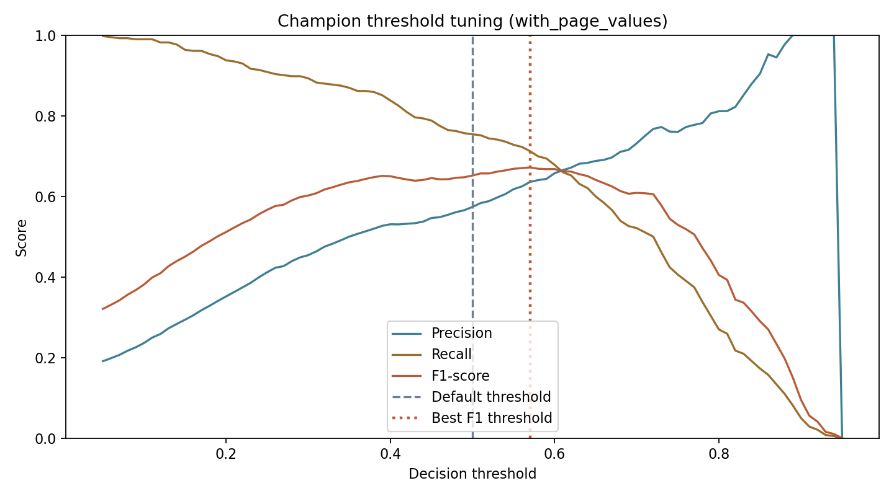

The F1-optimal threshold of 0.57 improves precision from 0.5737 to 0.6355 (+10.8%) at a modest cost to recall (0.7539 → 0.7120). For higher-cost interventions such as discount vouchers or human agent support, this threshold reduces wasted actions while maintaining strong buyer coverage.

For the model without `PageValues`, threshold tuning yields only marginal F1 improvement (0.3991 → 0.4009). This confirms that the performance deficit stems from missing predictive signal, not from a suboptimal decision boundary. No amount of threshold tuning can compensate for absent information.

### 3.6 Business Cost Matrix and Value Optimization

A business scenario was defined with the following cost matrix:

| Prediction outcome | Business value | Rationale |
| --- | ---: | --- |
| True positive | +20 | Correctly targeted buyer generates revenue lift |
| False positive | −2 | Marketing action sent to non-buyer — small resource cost |
| False negative | 0 | Missed buyer — opportunity cost, but no direct action cost |
| True negative | 0 | Non-buyer correctly ignored — no cost, no gain |

The 10:1 ratio of TP gain to FP cost reflects a realistic scenario where the marginal cost of a recommendation block or retargeting impression is small relative to the revenue from a converted session.

**Business value on the test set (with PageValues):**

| Selection | Threshold | TP | FP | FN | TN | Business value |
| --- | ---: | ---: | ---: | ---: | ---: | ---: |
| Default | 0.50 | 288 | 214 | 94 | 1,870 | **5,332** |
| Best F1 | 0.57 | 272 | 156 | 110 | 1,928 | 5,128 |
| Best business value | 0.29 | 343 | 422 | 39 | 1,662 | **6,016** |

**Business value on the test set (without PageValues):**

| Selection | Threshold | TP | FP | FN | TN | Business value |
| --- | ---: | ---: | ---: | ---: | ---: | ---: |
| Default | 0.50 | 257 | 649 | 125 | 1,435 | 3,842 |
| Best F1 | 0.58 | 181 | 340 | 201 | 1,744 | 2,940 |
| Best business value | 0.33 | 350 | 1,181 | 32 | 903 | 4,638 |

The business-optimal threshold (0.29) diverges from the F1-optimal threshold (0.57) because the cost matrix strongly rewards recall: catching an additional buyer is worth 10× the cost of a false positive. Lowering the threshold captures 55 more true positives (343 vs. 288) at the cost of 208 additional false positives, netting an additional 684 units of business value. This illustrates a general principle: **statistical optimality and business optimality are not equivalent** unless the metric used for optimization matches the actual cost structure.

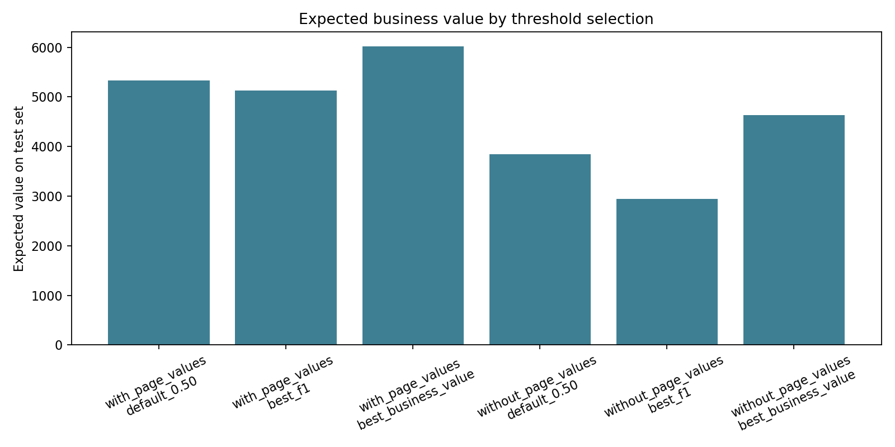

---

## 4. Challenger Models

Four challenger models were trained under the same preprocessing pipeline and CV protocol as the champion, spanning four distinct learning paradigms. The challengers serve two purposes: (1) they justify the choice of Random Forest by demonstrating that simpler or differently structured models underperform, and (2) they reveal different aspects of the data's structure through the nature of their failures.

### 4.1 Methodology

All models share:
- Identical `ColumnTransformer` preprocessing (fitted per fold)
- 3-fold stratified cross-validation
- GridSearchCV optimizing F1-score
- Identical train/test splits

Model-specific configurations are described below.

### 4.2 Model Specifications

**Logistic Regression** — a linear probabilistic classifier. Features are related to the log-odds of purchase through a linear combination of weights. `class_weight='balanced'` adjusts the loss function to account for the 15.47% positive rate. `solver='liblinear'` is used for efficiency on this dataset size. The regularization parameter `C` ∈ {0.1, 1.0, 10.0} was searched.

**Decision Tree** — a single recursive partitioning tree. `class_weight='balanced'` is applied. The grid searches `max_depth` ∈ {3, 5, 8, None} and `min_samples_leaf` ∈ {20, 50, 100}, balancing model complexity against overfitting. Decision Trees are included to test whether a single tree — without ensemble aggregation — achieves competitive performance.

**K-Nearest Neighbours (KNN)** — an instance-based, non-parametric method. KNN assigns class labels by majority vote among the k nearest neighbors in the preprocessed feature space. It has no explicit training phase (lazy learning). The grid searches `n_neighbors` ∈ {7, 15, 31} and `weights` ∈ {uniform, distance}. KNN does not natively support class weighting, which is a known limitation for imbalanced datasets.

**Gradient Boosting** — a sequential ensemble that constructs trees iteratively, each correcting the residual errors of the current ensemble. The grid searches `n_estimators` ∈ {100, 200}, `max_depth` ∈ {3, 5}, `learning_rate` ∈ {0.05, 0.1}, and `subsample` ∈ {0.8, 1.0}. Including `subsample < 1.0` introduces stochastic gradient boosting, which reduces overfitting and provides partial implicit handling of class imbalance by randomly sampling the training set per tree. Unlike Random Forest, `GradientBoostingClassifier` does not support a native `class_weight` parameter, which has material consequences in the without-PageValues scenario.

### 4.3 Cross-Validation Stability

Before examining test-set metrics, the cross-validation stability of each model is assessed through mean ± 1 standard deviation of F1-score across the 3 folds:

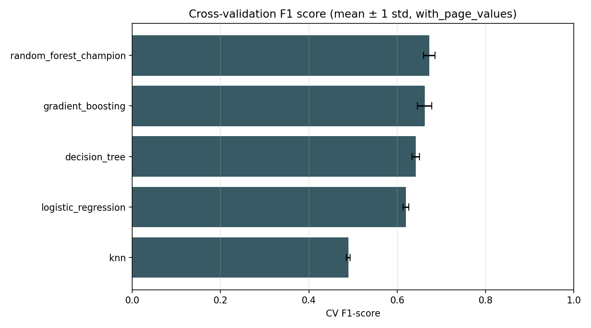

A high standard deviation relative to the mean indicates unstable performance across data subsets — the model is sensitive to which observations fall in the training vs. validation split. Ensemble methods (Random Forest, Gradient Boosting) are expected to show lower CV variance than single models (Decision Tree, KNN), because averaging across many trees filters out fold-specific noise.

### 4.4 Full Model Comparison (With PageValues)

| Model | Accuracy | Bal. Acc. | Precision | Recall | F1 | ROC-AUC | PR-AUC |
| --- | ---: | ---: | ---: | ---: | ---: | ---: | ---: |
| **Random Forest (champion)** | **0.8751** | 0.8256 | 0.5737 | **0.7539** | **0.6516** | 0.9202 | 0.7109 |
| Gradient Boosting | 0.8986 | 0.7711 | **0.7089** | 0.5864 | 0.6418 | **0.9264** | **0.7363** |
| Decision Tree | 0.8471 | **0.8443** | 0.5039 | 0.8403 | 0.6300 | 0.9173 | 0.6747 |
| Logistic Regression | 0.8455 | 0.8028 | 0.5009 | 0.7408 | 0.5977 | 0.8950 | 0.6252 |
| KNN | 0.8755 | 0.6677 | 0.6829 | 0.3665 | 0.4770 | 0.7962 | 0.5264 |
| Dummy Baseline | 0.8451 | 0.5000 | 0.0000 | 0.0000 | 0.0000 | 0.5000 | 0.1549 |

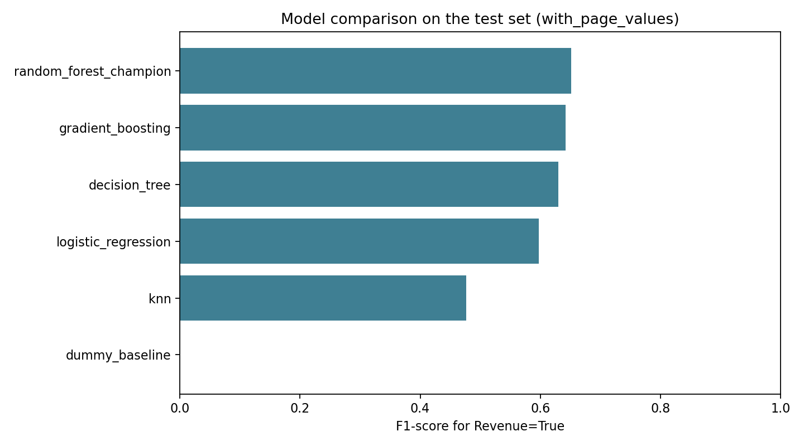

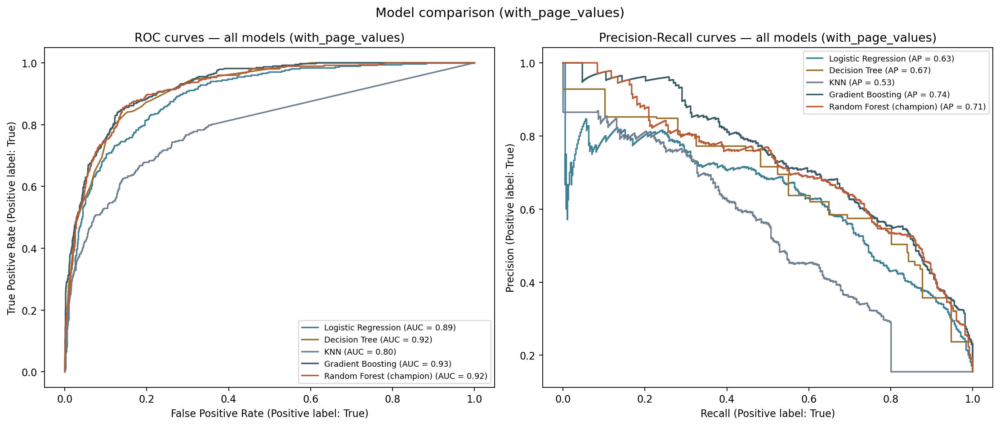

### 4.5 Challenger Analysis

**Logistic Regression** achieves F1 = 0.5977 and ROC-AUC = 0.8950 — the weakest performance among non-KNN models, but well above the dummy baseline. This result is informative: it establishes that a linear decision boundary in the preprocessed feature space is insufficient to fully capture purchase intent. The EDA identified non-linear relationships — for instance, `PageValues` is bimodally distributed with a mass at zero and a heavy right tail, and its interaction with `ExitRates` is not well approximated by a linear function. Logistic Regression's coefficient interpretability (log-odds per unit feature change) makes it valuable in regulatory or audit settings, but predictive performance is the criterion here, and linearity is too strong an assumption.

**Decision Tree** achieves the highest recall (0.8403) of any model, but at the cost of the lowest precision (0.5039) among the top four models, yielding F1 = 0.6300. This precision-recall trade-off reflects the inherent behavior of unpruned single trees: they grow rules that fit the training data very closely, creating decision boundaries that are highly specific to the observed data distribution. On the test set, these rules generate many false positives by applying overly narrow conditions that the model learned were sufficient in training but do not generalize. The Decision Tree's PR-AUC (0.6747 vs. champion's 0.7109) quantifies this generalization deficit. The high balanced accuracy (0.8443) — the highest among all models — shows that the tree treats both classes symmetrically in terms of recall, which is a function of its class weighting; but symmetric recall across classes is not the same as accurate discrimination.

**KNN** produces the most paradoxical result: the highest raw accuracy (0.8755) combined with the lowest recall (0.3665) and the worst PR-AUC (0.5264). The high accuracy is entirely attributable to the majority class — KNN correctly classifies most non-buyers because the dense neighborhoods in feature space are overwhelmingly populated by non-buyers (84.5% of sessions). For the minority class, KNN's local majority vote fails: even a genuine buyer's nearest neighbors are statistically more likely to be non-buyers. The lack of native class weighting in KNN means it cannot counteract this structural bias. KNN also assumes that Euclidean distance in the preprocessed feature space is a meaningful similarity metric, which may not hold for a heterogeneous mix of page counts, durations, bounce rates, and one-hot encoded categorical features. The ROC-AUC of 0.7962 and PR-AUC of 0.5264 — well below all other non-dummy models — confirm that KNN is poorly suited for this imbalanced tabular classification task.

**Gradient Boosting** is the most competitive challenger and deserves detailed comparison with the champion. At the feature level, Gradient Boosting achieves higher ROC-AUC (0.9264 vs. 0.9202) and PR-AUC (0.7363 vs. 0.7109), meaning that as a *ranking* model — producing a score that orders sessions from most to least likely to purchase — it is slightly superior to Random Forest. However, at any fixed decision threshold, the picture changes. Gradient Boosting's recall at the default threshold (0.5864) is substantially lower than Random Forest's (0.7539), while its precision (0.7089) is higher. This threshold-specific trade-off reflects the different ways bagging and boosting construct their probability outputs.

More critically, Gradient Boosting's performance under the without-PageValues scenario reveals a fundamental weakness: its F1 collapses from 0.6418 to 0.2141 (a drop of 0.4277), while Random Forest falls from 0.6516 to 0.3991 (a drop of 0.2525). The GBM collapse is explained by the absence of a native class-weight mechanism: without `PageValues` providing a dominant separating signal, the GBM effectively learns to predict the majority class. The `subsample` parameter provides only partial mitigation, as it randomizes the training sample per tree but does not rebalance class frequencies. This class-imbalance fragility is a decisive factor in champion selection for a real-world deployment where `PageValues` availability cannot be guaranteed.

### 4.6 Learning Curve Analysis

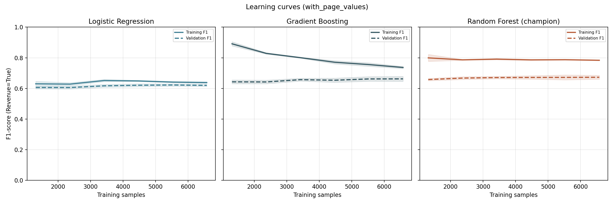

Learning curves plot training and validation F1-score as a function of training set size, revealing the bias-variance profile of each model:

- **Logistic Regression** shows convergent training and validation curves at a relatively low plateau — the hallmark of a high-bias model. Adding more data would not materially improve performance; the model is limited by the expressiveness of its linear form.
- **Decision Tree** shows a wide gap between training (near-perfect F1) and validation F1 at small training sizes, with the gap narrowing as more data is added — characteristic of a high-variance model that is overfitting, with some reduction as training data grows.
- **Random Forest** shows a moderate and stable gap between training and validation curves, with validation F1 increasing smoothly as training size grows. This is the ideal profile: the model is learning genuine signal, and additional data continues to improve performance without large variance spikes. The gap between training and validation does not widen with more data, confirming that the ensemble regularization (bootstrapping + feature subsampling) effectively controls overfitting.

### 4.7 Champion Selection Summary

The Random Forest is retained as champion on the basis of:

1. **Highest F1-score** (0.6516) — the primary optimization target.
2. **Highest recall** (0.7539) — critical for maximizing business value under the given cost matrix.
3. **Strong ROC-AUC** (0.9202) — only marginally below Gradient Boosting's 0.9264.
4. **Robust class-imbalance handling** — `balanced_subsample` prevents majority-class collapse under all feature scenarios.
5. **Consistent performance across scenarios** — F1 drops by 0.2525 without PageValues, vs. 0.4277 for Gradient Boosting, demonstrating greater resilience to missing features.
6. **Stable learning curves** — the model generalizes progressively, with no sign of high variance or underfitting at the current dataset size.

Gradient Boosting remains the first model to revisit in future work: implementing class-weight support (via `HistGradientBoostingClassifier`, which accepts `class_weight='balanced'`, or through per-sample weights passed to the `fit` method) would likely close the recall gap and could make it competitive with or superior to Random Forest on all metrics.

---

## 5. Results: Data Science Standpoint

### 5.1 Evaluation Framework

Evaluating an imbalanced binary classifier requires a multi-metric framework. The metrics used in this study and their roles:

- **Accuracy**: reported for completeness but explicitly insufficient — the dummy classifier achieves 84.51% accuracy.
- **Balanced accuracy**: average recall across both classes; robust to imbalance.
- **Precision**: fraction of positive predictions that are correct — penalizes false positives.
- **Recall (sensitivity)**: fraction of true positives captured — penalizes false negatives.
- **F1-score**: harmonic mean of precision and recall; punishes large imbalances between the two.
- **ROC-AUC**: probability that the model ranks a random positive higher than a random negative; threshold-independent.
- **PR-AUC (Average Precision)**: area under the precision-recall curve; more informative than ROC-AUC under class imbalance because it directly captures performance on the minority class.

A PR-AUC of 0.7109 (champion, with PageValues) vs. a random baseline of 0.1549 represents a **4.59× improvement** in the ability to rank buyers above non-buyers. This is the most meaningful single metric for this problem.

### 5.2 Feature Importance and Model Interpretability

Permutation importance measures the decrease in test-set F1 when a feature's values are randomly shuffled, breaking its relationship with the target:

| Rank | Feature | Mean F1 Decrease | Std |
| ---: | --- | ---: | ---: |
| 1 | PageValues | 0.4083 | ±0.0071 |
| 2 | Month | 0.0119 | ±0.0061 |
| 3 | Administrative | 0.0042 | ±0.0031 |
| 4 | SpecialDay | 0.0017 | ±0.0012 |
| 5 | ProductRelated_Duration | 0.0012 | ±0.0018 |
| 6 | TrafficType | 0.0005 | ±0.0012 |
| 7–17 | All others | ≤ 0.001 | — |

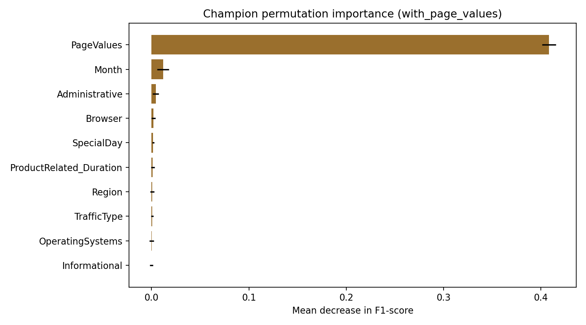

The dominance of `PageValues` (importance = 0.4083) over the next feature `Month` (0.0119) is extreme — a 34× gap. Shuffling `PageValues` alone drops F1 by 40.8 percentage points, while removing all other features combined would reduce it by roughly 5 percentage points. This concentration of predictive signal is the defining characteristic of the dataset and should be communicated clearly to any business stakeholder planning to deploy the model.

The negative importance values for several features (e.g., `ExitRates`, `BounceRates`) indicate that these features introduce slight noise: shuffling them marginally *improves* F1 because the model was using them in a slightly counterproductive way. This suggests these features could potentially be dropped without performance loss — a direction worth exploring through more rigorous feature selection.

**SHAP value analysis:**

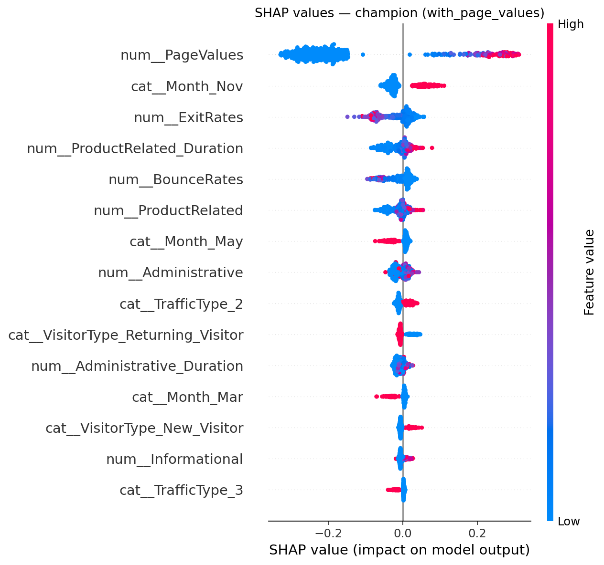

SHAP (SHapley Additive exPlanations) values provide a session-level decomposition of each model prediction into per-feature contributions. The beeswarm plot confirms the permutation importance ranking but adds directional information: high `PageValues` consistently pushes predictions toward Revenue=True (positive SHAP), while low `PageValues` (including the zero mass) pushes strongly toward Revenue=False. The relationship is monotone and large in magnitude relative to all other features, which are mostly clustered near zero SHAP contribution. `Month` shows the next-largest spread, with November and high-conversion months contributing positive SHAP values for sessions in those periods.

### 5.3 Without-PageValues Feature Importance

After removing `PageValues`, the importance profile shifts substantially:

The features with the most predictive power become `ExitRates`, `ProductRelated_Duration`, `Month`, `BounceRates`, and `VisitorType`. These features collectively describe the behavioral and contextual profile of a session without the direct monetary signal from `PageValues`. Their lower predictive power (the combined model F1 drops from 0.6516 to 0.3991) reflects the fundamental information gap: page value is a more direct measure of purchase intent than behavioral proxies.

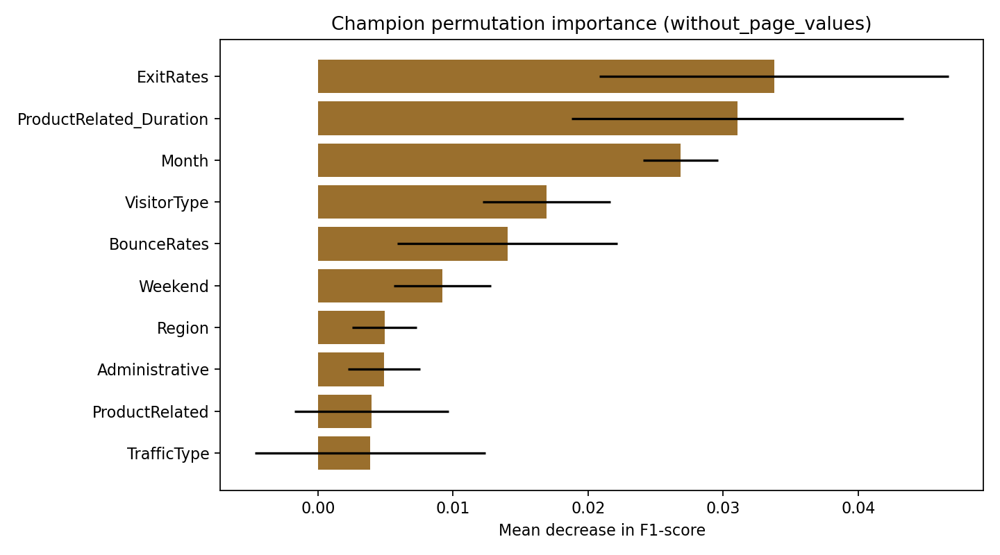

### 5.4 Probability Calibration

Threshold optimization and business-value scoring both assume that the model's predicted probability scores are meaningful — that a score of 0.60 reflects a ~60% empirical purchase probability. If probabilities are systematically over- or underestimated, threshold selection becomes unreliable.

Calibration curves (reliability diagrams) compare mean predicted probability within each probability bin to the observed conversion rate in that bin. A perfectly calibrated model lies on the diagonal.

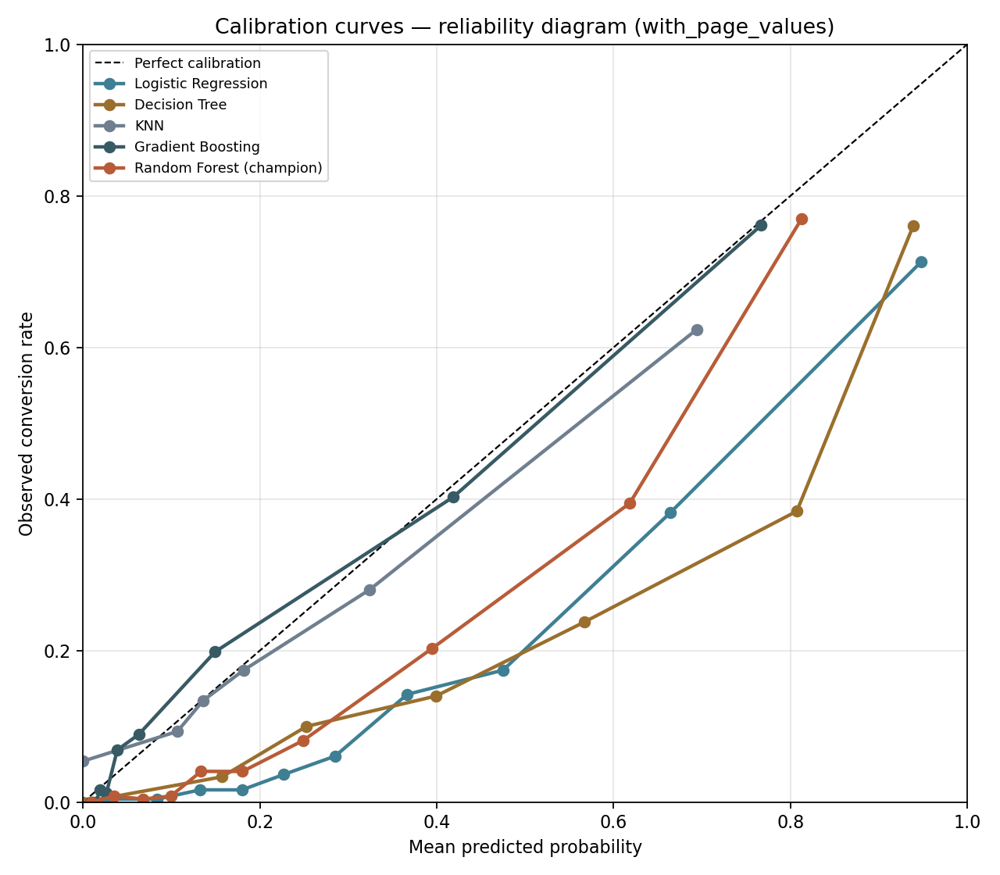

Random Forest classifiers are known to produce **overconfident probability estimates**, typically because individual trees vote discretely (0 or 1) and the ensemble average is pulled toward the class prior rather than spanning the full [0,1] range. This manifests as a curve that bows below the diagonal at high predicted probabilities. Logistic Regression is typically better calibrated for problems that are approximately linear. Decision Trees tend to produce poorly calibrated, step-function probabilities due to their discrete leaf structure.

If the predicted score is to be used as a monetary estimate (e.g., "this visitor has a 70% chance of purchasing a basket worth €50, so the expected value of intervening is €35 minus action cost"), then **probability calibration is essential**. Post-hoc calibration via Platt scaling (fitting a logistic regression on the model's output probabilities on a held-out set) or isotonic regression is recommended before using the model's scores for expected-value calculation. However, for threshold-based decision rules (flag if score > k), calibration affects only the mapping between the internal score and the threshold value — the business value calculation based on observed TP/FP counts remains valid regardless of calibration.

### 5.5 Generalization Considerations

Several factors limit the generalizability of these results to other settings:

**Temporal validity:** The model is trained and tested on data from a single 12-month period at a single website. Seasonal patterns (notably November's 25.4% conversion rate) are learned implicitly through the `Month` feature. A model deployed in a subsequent year may experience seasonal distribution shift if campaign strategies or promotional calendars change.

**Site specificity:** The `PageValues` feature is computed from Google Analytics e-commerce data that is specific to the website's product catalogue and pricing. A model trained on this data cannot be directly applied to a different e-commerce platform.

**No causal identification:** The model identifies correlates of purchase intent, not causes. Features that are correlated with `PageValues` may lose their predictive value once `PageValues` is controlled for (as the permutation importance analysis demonstrates). Interventions should be designed and evaluated through A/B testing rather than assumed to generate lift based on the model's correlational output alone.

---

## 6. Results: Business Standpoint

### 6.1 Deployment Architecture

The model can serve as the scoring engine for a real-time visitor segmentation system. The two model variants correspond to distinct integration points in the session lifecycle:

**Late-session scoring (with PageValues):** The model is called at the end of a browsing session or shortly before a visitor abandons the site. `PageValues` is available because the visitor has already navigated through a set of pages. This variant is most appropriate for exit-intent triggers, post-session email retargeting, or end-of-session recommendation adjustments. It provides the highest accuracy (F1 = 0.6516) and best business value.

**Early-session scoring (without PageValues):** The model is called in the first few page views, before `PageValues` has accumulated. This enables early intervention — showing a welcome discount, triggering a live chat prompt, or adjusting the recommendation carousel from the first product page view. Accuracy is lower (F1 = 0.3991) but the intervention opportunity is earlier and potentially higher-impact per interaction.

A two-stage architecture combining both models provides the best of both approaches: deploy the early-session model to flag high-potential visitors within the first 2–3 page views, then update the score using the full model as more session data accumulates.

### 6.2 Practical Applications

| Application | Recommended threshold | Model variant |
| --- | --- | --- |
| Exit-intent popup or offer | 0.57 (high precision) | With PageValues |
| Recommendation carousel personalization | 0.38 (high recall) | With PageValues |
| Live chat routing | 0.57–0.65 (precision-priority) | With PageValues |
| Early-session welcome incentive | 0.33–0.40 | Without PageValues |
| Retargeting audience segment | 0.29 (max business value) | With PageValues |
| Email abandonment trigger | 0.45–0.50 | Either variant |

### 6.3 Quantitative Business Impact

To illustrate practical impact, consider a site receiving **50,000 sessions per month** with the same 15.47% conversion rate, implying approximately 7,735 genuine buyers per month. Scaling the test-set results proportionally (test set = 2,466 sessions):

| Strategy | Monthly flagged | True buyers reached | False actions | Monthly business value |
| --- | ---: | ---: | ---: | ---: |
| No targeting (baseline) | 0 | 0 | 0 | 0 |
| Target all visitors | 50,000 | 7,735 | 42,265 | +69,820 |
| Champion at threshold 0.57 (best F1) | 8,685 | 5,513 | 3,163 | +103,594 |
| Champion at threshold 0.29 (best BV) | 15,499 | 6,949 | 8,550 | +121,880 |

Under the assumed cost matrix (TP = +20, FP = −2):

- **Targeting everyone** generates +69,820 units of business value but directs 84.5% of actions at non-buyers — inefficient if action cost is non-trivial.
- **Threshold 0.57** reduces actions by 82.6% while retaining 71.3% of buyers, generating **48% more value** than blanket targeting and drastically fewer wasted interventions.
- **Threshold 0.29** retains 89.8% of buyers at a higher false-positive load, generating **74% more value** than blanket targeting — optimal when action cost is low (e.g., on-site personalization with no marginal cost per session).

These projections assume the same behavioral distribution as the training period. Production deployment requires continuous monitoring and periodic retraining to account for seasonal drift, campaign changes, and product catalogue evolution.

### 6.4 Comparison: With vs. Without PageValues (Business Implications)

| Strategy | Monthly business value | vs. No targeting |
| --- | ---: | ---: |
| Without PageValues — threshold 0.33 (best BV) | ~93,810 | +34.4% |
| With PageValues — threshold 0.29 (best BV) | +121,880 | +74.5% |
| Delta (PageValues uplift) | ~28,070/month | — |

If `PageValues` is available in production, the model generates approximately **28,000 more units of business value per month** relative to the early-session model (under the same 50,000-session, same-cost-matrix assumptions). This quantifies the business cost of early-session scoring: deploying the model before `PageValues` is available sacrifices roughly 30% of the achievable business value in exchange for earlier intervention capability.

### 6.5 Implementation Checklist

Before production deployment, the following steps are recommended:

1. **Confirm feature availability at inference time** — particularly whether `PageValues` is computable in real time or requires post-session aggregation.
2. **Validate probability calibration** — apply Platt scaling or isotonic regression if predicted scores will be used for expected-value calculations or score-based tiering.
3. **Select the decision threshold based on actual action cost** — the cost matrix values used here (TP = +20, FP = −2) are assumed; a data-driven cost matrix using actual margin per conversion and cost per marketing action will shift the optimal threshold.
4. **Run an A/B test** — validate that model-driven interventions generate incremental lift relative to the control group before scaling. The model identifies likely buyers, but the intervention's causal effect on conversion is a separate question.
5. **Set up a monitoring pipeline** — track model score distribution, conversion rate by score decile, and feature drift (especially `PageValues` and `Month`) over time. Re-train periodically, at minimum after major promotional periods.
6. **Assess regulatory requirements** — if the model influences pricing, service access, or communication eligibility, explainability requirements (e.g., GDPR article 22 on automated decision-making) may apply. In that case, Logistic Regression or a SHAP-explained Random Forest should be reviewed with the legal and compliance team.

---

## 7. Conclusion

This study demonstrates that session-level purchase intent in e-commerce can be predicted with meaningful accuracy using publicly available behavioral signals. The champion Random Forest achieves **F1 = 0.6516, ROC-AUC = 0.9202, and PR-AUC = 0.7109** — a 4.6× improvement over random ranking on the minority class — using a rigorously held-out test set and a full preprocessing pipeline that prevents data leakage.

The most consequential finding is the centrality of `PageValues`: removing this single feature drops F1 from 0.6516 to 0.3991 and PR-AUC from 0.7109 to 0.3529. This concentration of predictive signal has two competing implications. On one hand, it makes the late-session model highly accurate and commercially valuable. On the other hand, it means the model is not a general behavioral classifier — it is heavily anchored to a single monetary proxy. Future work should investigate whether `PageValues` can be approximated earlier in the session (e.g., using the first-viewed product's price or category as a proxy) to bridge the gap between the two deployment scenarios.

The challenger analysis reveals important lessons about algorithm selection for imbalanced tabular data. Gradient Boosting achieves superior ranking metrics (ROC-AUC 0.9264, PR-AUC 0.7363) but is fragile under class imbalance without native class-weight support — its F1 collapses from 0.6418 to 0.2141 when `PageValues` is removed. KNN fails due to the majority-class dominance of local neighborhoods. Logistic Regression establishes that non-linearity is required. Decision Tree confirms that ensemble aggregation is necessary for consistent precision.

Three methodological lessons generalize beyond this dataset: **first**, accuracy is an unreliable primary metric for imbalanced classification — PR-AUC and business-value analysis provide more actionable signal. **Second**, statistical optimization and business optimization diverge when misclassification costs are asymmetric — threshold tuning under the actual cost matrix is not optional. **Third**, model evaluation must always assess feature availability in the deployment context — a model that depends on post-session features cannot serve early-session use cases, regardless of how well it performs on the test set.

---

## Appendix

### A. EDA Figures

- A1: Conversion rate by visitor type
- A2: Product-related duration by revenue outcome
- A3: Correlation heatmap (numerical features)
- A4: BounceRates vs. ExitRates scatter (colored by Revenue)
- A5: Numerical feature distributions (all 14 numerical features)

### B. Model Figures (Appendix)

- A6: Champion permutation feature importance (with PageValues)
- A7: Champion precision-recall curve (with PageValues)
- A8: Champion ROC curve (with PageValues)
- A9: Threshold tuning curve (without PageValues)
- A10: Feature importance (without PageValues)
- A11: Confusion matrix (without PageValues)
- A12: Precision-recall curve (without PageValues)
- A13: ROC curve (without PageValues)
- A14: Model F1 comparison (without PageValues)
- A15: Learning curves (with PageValues)
- A16: Learning curves (without PageValues)
- A17: SHAP beeswarm (champion, with PageValues)
- A18: CV F1 score summary (with PageValues)
- A19: Calibration curves (without PageValues)

### C. Data Tables (CSV outputs)

All numerical results are available as CSV files in `outputs/main/` and `outputs/appendix/`.

---

## Sources

- UCI Machine Learning Repository. *Online Shoppers Purchasing Intention Dataset*: https://archive.ics.uci.edu/dataset/468/online+shoppers+purchasing+intention+dataset
- Sakar, C.O. & Kastro, Y. (2018). Online Shoppers Purchasing Intention Dataset [Dataset]. UCI Machine Learning Repository. https://doi.org/10.24432/C5F88Q
- Breiman, L. (2001). Random Forests. *Machine Learning*, 45(1), 5–32.
- Lundberg, S.M. & Lee, S.I. (2017). A unified approach to interpreting model predictions. *Advances in Neural Information Processing Systems*, 30.
- Saito, T. & Rehmsmeier, M. (2015). The precision-recall plot is more informative than the ROC plot when evaluating binary classifiers on imbalanced datasets. *PLOS ONE*, 10(3).
